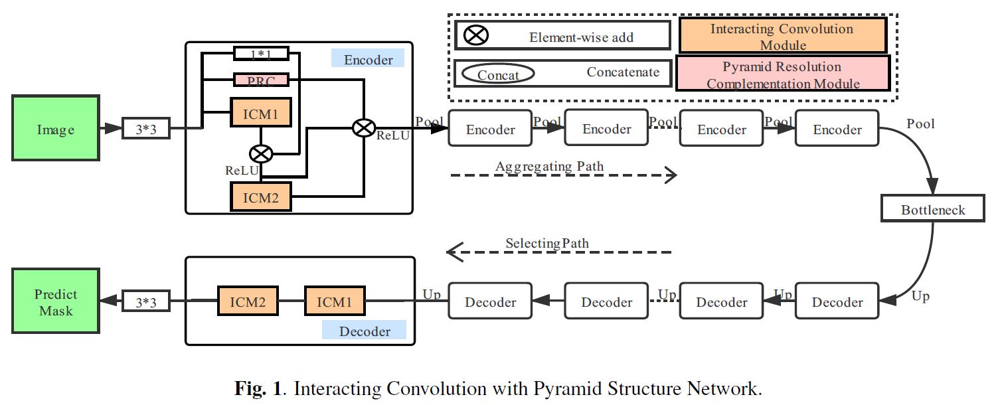
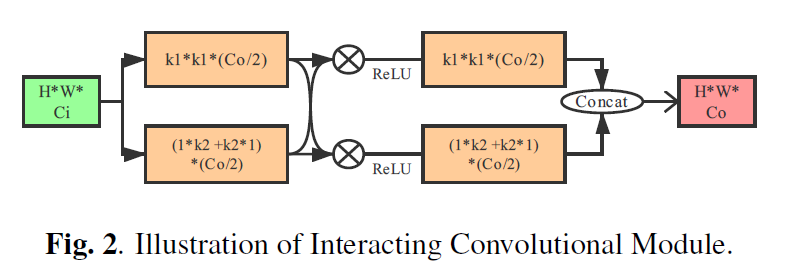
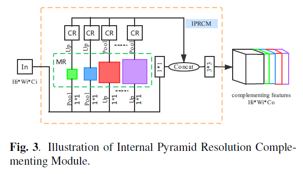
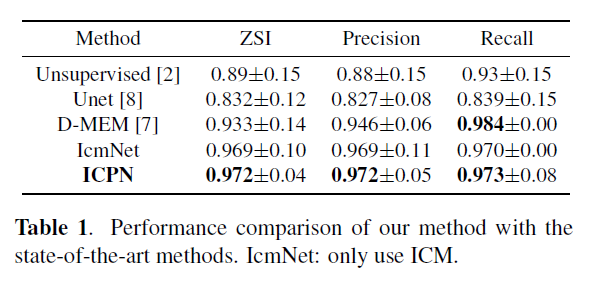

# INTERACTING CONVOLUTION WITH PYRAMID STRUCTURE NETWORK FOR AUTOMATED SEGMENTATION OF CERVICAL NUCLEI IN PAP SMEAR IMAGES
By Xiaoqing Yang, Junmin Wu, Yan Yin.

## Introduction
We propose an Interacting Convolution with Pyramid Structure Network (ICPN), which consists of a sufficient aggregation path that focus on more nucleus contexts and a selecting path that enable nucleus localization. The two paths are built on Interacting Convolutional Modules (ICM) and Internal Pyramid Resolution Complementing Modules (IPRCM) respectively. We evaluate our network on public [Herlev dataset(Part II-smear2005.zip)](http://mde-lab.aegean.gr/index.php/downloads).

## Architecture

Overview of the proposed ICPN for cervical nuclei nucleus segmentation. ICPN consits of two paths: the aggregating path and selecting path. The former has N encoders and the latter has N decoders. There are no additional skip connections between two paths.

## Interacting Convolutional Module

Interacting Convolutional Module has two parallel convolution paths. The upper path uses a smaller convolution kernel to capture detailed structural information inside the nucleus, while the lower path uses a relatively large convolution kernel to catch the global context of the overall structure of the nucleus. There is an information exchange in the process. Similar to the GCN, we use the similar approach to reduce parameters (batch normalization, separate kernels). 

Internal Pyramid Resolution Complementing Module converts the features of the current resolution representations and restores these multiresolution features to the current resolution size. This process captures the potential multiresulution representations of the current resolution features, thereby compensating for the loss of information caused by the pooling layer. The 1*1 convolutional layer is used for dimensionality reduction.

## Herlev testing result

#Usage
1. Install tensorflow and keras
   
